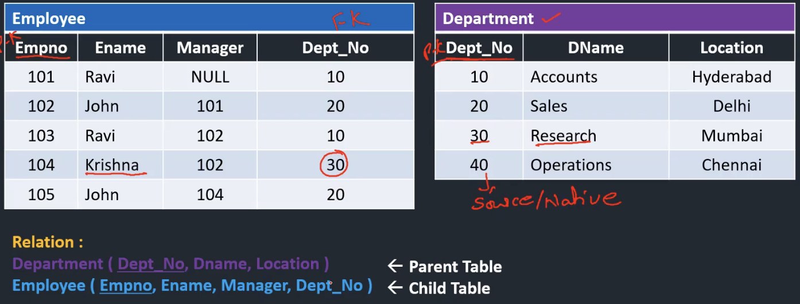

# Key
**키(key)** 는 데이터베이스에서 조건에 만족하는 튜플을 찾거나 순서대로 정렬할 때 ***다른 튜플들과 구별할 수 있는 유일한 기준이 되는 Attribute(속성)*** 이다.

- **Tuple(튜플)**: ***릴레이션(테이블)을 구성하는 각각의 행으로 속성의 모임*** 으로 구성된다. 파일 구조에서 레코드와 같은 개념, 튜플의 수 = 카디널리티(Cardinality) = 기수 = 대응수
- **Relation(릴레이션)**: 동일한 구조로 이루어진 튜플의 집합이다. 쉽게 말하면 데이터를 원자값으로 갖는 테이블이다.

---

# Candidate Key (후보키)

**Candidate Key (후보키)** 란 **릴레이션을 구성하는 속성들 중 한 튜플(레코드)을 유일하게 식별할 수 있는 속성들(attributes)의 최소 집합(부분 집합)** 이다.

후보키는 다음 특징을 지닌다.

- 후보키의 값은 모든 튜플에 대해서 **유일**하고 **non-null** 이어야 한다.
- 모든 릴레이션은 반드시 하나 이상의 후보키를 가져야한다.

---

# Primary Key (기본키)

**Primary key (기본키)** 란 ***후보키 중 선택된 주키**로 **한 릴레이션(테이블)에서 어떤 튜플이든 유일하게 구별할 수 있는 속성***이다.

후보키는 다음 특징을 지닌다.

- **NULL 값을 가질 수 없다.** ⇒ 개체 무결성의 첫 번째 조건
- **기본키인 속성값에 동일한 값이 중복되어 저장될 수 없다.** ⇒ 개체 무결성의 두 번째 조건
- 1 = P.K ≤(포함) C.K ≥1
    
    ⇒ 기본키가 될 수 있는 키들을 후보키라고 한다.
    

---

# Alternate Key (대체키)

**Alternate Key (대체키)** 란 **후보키 중 기본키를 제외한 나머지 후보키**를 말한다.

---

# Super Key (슈퍼키)

**Super Key(슈퍼키)** 란 **릴레이션을 구성하는 어떤 튜플에 대해 유일성을 만족하지만, 최소성을 만족시키지 못하는 속성들의 집합** 이다.

슈퍼키는 다음 특징을 지닌다.

- 후보키에 0개 이상의 속성을 추가하면 슈퍼키가 된다.
- 후보키는 슈퍼키이다. 하지만, 역은 성립하지 않는다.
- S.K ≥ C.K ≥ P.K

---

# Foreign Key (외래키)

**Foreign Key(외래키)** 란 **또다른 릴레이션(테이블)의 기본키(primary key)를 가리키는 데 사용되는 한 릴레이션(테이블)의 속성** 이다.

외래키는 참조되는 릴레이션의 기본키와 대응되어 릴레이션 간에 참조 관계를 표현하는데 중요한 도구로 사용된다.

