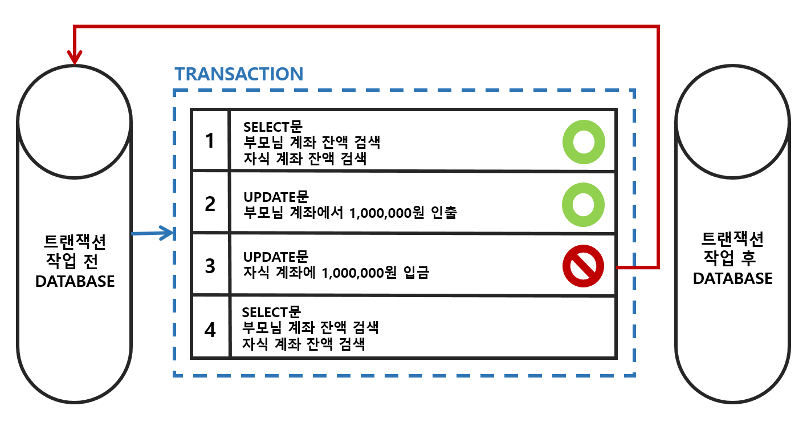
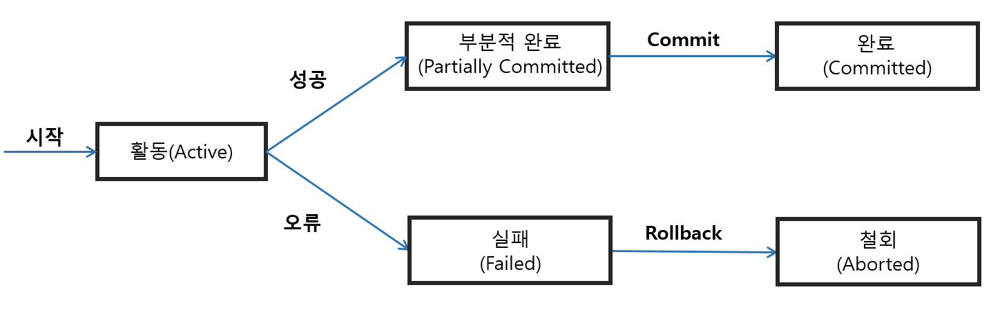

# Transaction(트랜잭션) 이란?

**Transaction(트랜잭션)** 이란 ***한 논리적인 작업 단위를 수행하는 연산의 집합*** 이다. 쉽게 말해서 ***데이터베이스의 상태를 변경하기 위해 수행하는 작업의 단위*** 를 뜻한다.

- 데이터베이스의 상태를 변경한다는 건 어떤 의미일까?
    
    SQL(질의어)를 이용하여 데이터베이스에 접근하여 값 추가, 변경, 삭제 등을 수행하는 것을 의미한다.
    

**주의**: **트랜잭션이 작업 단위라 해서 질의어 한 문장이 아니다!!**

작업 단위는 하나의 논리적 연산을 수행하는 많은 연산(질의어 등)들의 집합이다. 이러한 집합은 직접 사용자에 의해 설계된다. 

아래 예시는 A -> B 로 100만원을 보내는 상황이다.

```
Read(A)      | A 통장 잔액을 읽는다.
A = A - 100  | A 통장 잔액에서 100 을 뺀다.
Write(A)     | 수정된 A 통장 잔액을 통장에 작성한다.
Read(B)      | B 통장 잔액을 읽는다.
B = B + 100  | B 통장 잔액에서 100 을 더한다.
Write(B)     | 수정된 B 통장 잔액을 통장에 작성한다.
commit;      | 위의 연산들을 영구적으로 반영한다.
```

이 전체 연산들을 하나의 논리적 작업(100만원 송금)을 트랜잭션(transaction) 이라 한다.

---

# Transaction(트랜잭션) 특징

트랜잭션의 특징은 대표적으로 4가지로 구분된다.

1. 원자성(Atomicity)
2. 일관성(Consistency)
3. 독립성(Isolation)
4. 지속성(Durability)

이러한 특징들은 **하나의 트랜잭션(transaction)의 안정성을 보장하기 위해 필요한 성질** 이다.

## 1. Atomicity(원자성)

원자성은 **트랜잭션이 데이터베이스에 모두 반영되던가 혹은 전혀 반영되지 않아야 한다는 성질** 이다. 즉, 트랜잭션 내 모든 명령은 반드시 완벽히 수행되어야 하며, 모두가 완벽히 수행되지 않고 하나라도 오류가 발생하면 트랜잭션 내 모든 명령을 취소되어야 한다.

만약 원자성을 보장하지 않는다면 설계된 작업을 이해하는데 어려울 뿐만아니라, 문제 발생 시 원일을 찾기 힘들 것이다.

## 2. Consistency(일관성)

일관성은 **트랜잭션이 성공적으로 완료하면 언제나 일관성 있는 데이터베이스 상태로 유지하는 성질** 이다. 즉, 트랜잭션이 일어난 이후의 데이터베이스는 트랜잭션이 일어나기 전의 제약 또는 조건을 만족해야만 한다.

예를 들어 ‘대학생은 반드시 학번을 가지고 있어야 한다’는 데이터베이스의 조건이 있다고 가정해보자. 

다음 2개의 트랜잭션은 일관성에 위반된다.

- 학번이 없는 학생을 추가하는 연산
- 기존 학생의 학번을 삭제하는 연산

## 3. Isolation(독립성)

독립성은 **모든 트랜잭션은 다른 트랜잭션으로부터 독립** 되어야 한다는 성질이다. 즉, **여러 트랜잭션이 동시에 실행되어도 하나의 트랜잭션만 수행되었을 때와 동일한 결과** 가 나와야한다.

## 4. Durability(지속성)

지속성은 **하나의 트랜잭션이 성공적으로 수행되었다면, 트랜잭션 결과는 시스템에 오류가 발생하더라도 영구적으로 반영되어야 한다는 성질**이다. 즉, **해당 트랜잭션에 대한 로그(기록)가 남아야된다.**

예를 들어, 계좌이체가 성공적으로 수행되면, 해당 은행 데이터베이스에 오류가 발생해 종료된다고 하더라도 계좌이체 내역은 영구적으로 반영되어야 한다.

---

# Transaction(트랜잭션) 연산

### Commit 연산

Commit 연산은 **한 트랜잭션의 모든 연산을 정상적으로 처리하겠다고 확정하는 명령** 으로서, **처리과정을 데이터베이스에 영구적으로 저장** 하는 것이다. commit 연산을 수행하면 하나의 트랜잭션 과정이 종료된다. 그럼 이전 데이터가 완전히 업데이트된다.

### Rollback 연산

Rollback 연산은 **작업 중 문제가 발생되어 트랜잭션 처리과정에서 발생한 모든 변경사항을 취소하는 명령** 이다. 이 트랜잭션의 일부가 정상적으로 처리되었더라도 트랜잭션의 원자성을 보장하기 위해 이 트랜잭션이 행한 모든 연산을 취소한다.

Rollback 연산 시 해당 트랜잭션을 재시작하거나 폐기한다.


[http://wiki.hash.kr/index.php/파일:트랜잭션의_필요성.png](http://wiki.hash.kr/index.php/%ED%8C%8C%EC%9D%BC:%ED%8A%B8%EB%9E%9C%EC%9E%AD%EC%85%98%EC%9D%98_%ED%95%84%EC%9A%94%EC%84%B1.png)

위의 그림을 보면 1, 2번 연산은 정상적으로 처리가 되었지만, 3번 연산에서 오류가 발생했다. 트랜잭션의 원자성을 보장하기 위해 Rollback 연산을 수행하여 해당 트랜잭션 작업 전 상태로 가도록 이전 작업을 모두 취소한다.

---

# Transaction(트랜잭션) 상태

트랜잭션은 5가지의 상태를 갖는다.


[http://wiki.hash.kr/index.php/트랜잭션](http://wiki.hash.kr/index.php/%ED%8A%B8%EB%9E%9C%EC%9E%AD%EC%85%98)

- **활동(Active)**: 트랜잭션이 실행 중인 상태
- **실패(Failed)**: 트랜잭션 실행에 오류가 발생하여 중단된 상태
- **철회(Aborted)**: 트랜잭션이 비정상적으로 종료되어 Rollback 연산을 수행한 상태
- **부분 완료(Partially Committed)**: 트랜잭션의 마지막 연산까지 실행했지만, Commit 연산이 실행되기 직전의 상태
- **완료(Committed)**: 트랜잭션이 성공적으로 종료되어 Commit 연산을 실행한 후의 상태

---

### References

- [https://hanamon.kr/데이터베이스-트랜잭션의-acid-성질/](https://hanamon.kr/%EB%8D%B0%EC%9D%B4%ED%84%B0%EB%B2%A0%EC%9D%B4%EC%8A%A4-%ED%8A%B8%EB%9E%9C%EC%9E%AD%EC%85%98%EC%9D%98-acid-%EC%84%B1%EC%A7%88/)
- [https://mommoo.tistory.com/62](https://mommoo.tistory.com/62)
- [https://coding-factory.tistory.com/226](https://coding-factory.tistory.com/226)
- [http://wiki.hash.kr/index.php/트랜잭션](http://wiki.hash.kr/index.php/%ED%8A%B8%EB%9E%9C%EC%9E%AD%EC%85%98)