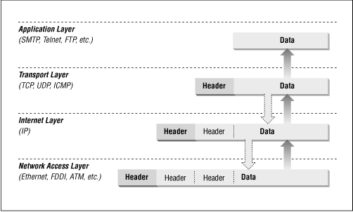
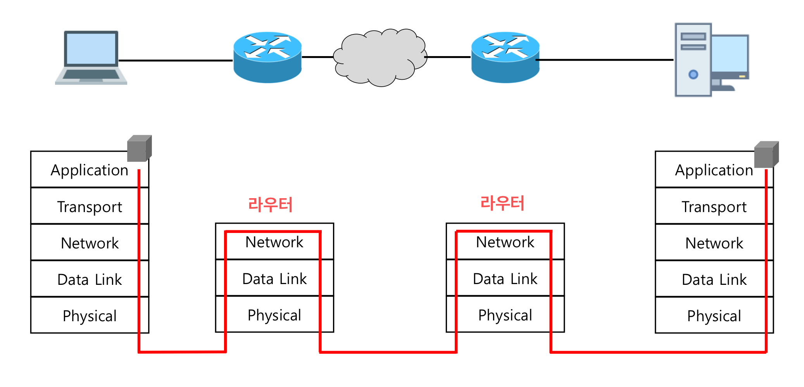
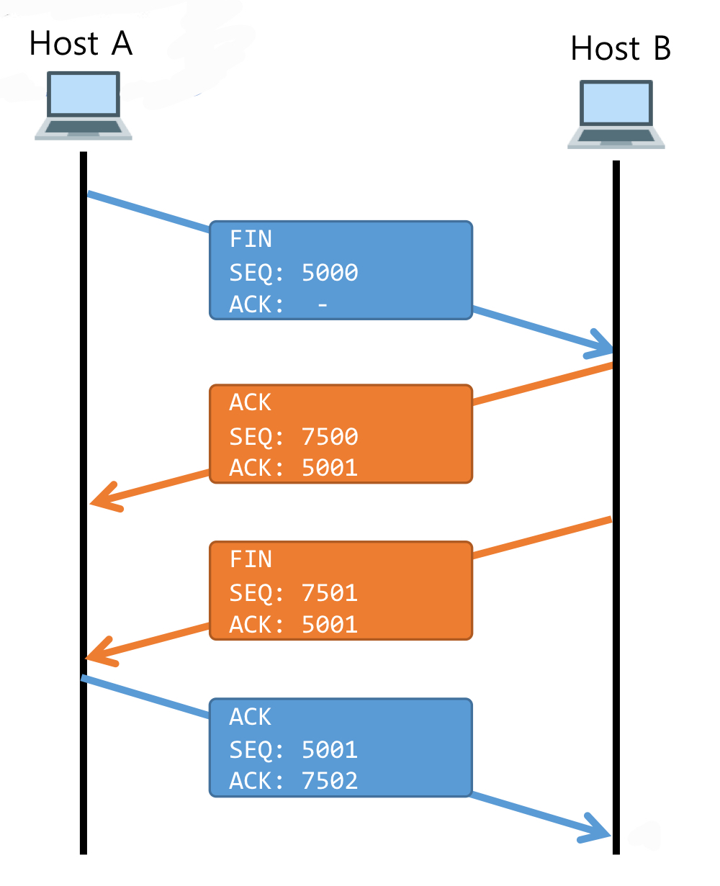

# Browser 에 URL 입력 시 무슨 일이 발생?

구글 크롬에 [www.naver.com](http://www.naver.com) URL 을 입력하면 어떤 일이 발생할까?

# 1. 브라우저는 [www.naver.com](http://www.naver.com) 이라는 URL 을 해석

브라우저에 URL 입력 시, 브라우저는 URL 을 해석하여 웹 서버와 파일명, 포트번호(웹서버: 80)을 판단하고 실제 HTTP 메시지 포맷에 맞게 GET 요청 메시지 작성을 준비한다.

크롬 브라우저의 경우, 브라우저 애플리케이션의 최상위 프로세스의 UI 스레드가 주소창에 입력된 값을 평가한다. 그 이유는 크롬 주소창은 검색창의 역할도 하기에 주소창에 입력한 문자열이 URL인지, 검색어인지를 검사한다.

# 2. 브라우저가 HTTP GET 요청 메시지를 작성

URL 해석 정보를 기반으로 HTTP 메시지 포맷에 맞는 상태라인, 헤더, 바디를 가지고 있는 GET 요청 메시지를 작성

# 3. URL 에 대한 DNS 요청을 OS 에 의뢰

1. OS 는 먼저 호스터 컴퓨터에 있는 ‘/etc/hosts.conf’ 파일을 확인한다. (리눅스 기준)
2. 해당 파일에 [www.naver.com](http://www.naver.com) 도메인과 맵핑되어 있는 IP 주소가 없으면 DNS 서버에 요청을 한다.
3. DNS 서버에 [www.naver.com](http://www.naver.com) 도메인의 정보가 캐싱 되어 있지 않다면 다음 과정을 수행한다.
4. [https://github.com/JihoJu/CS-Notes/blob/main/Network/Domain_DNS.md#dns-서버-질의-과정](https://github.com/JihoJu/CS-Notes/blob/main/Network/Domain_DNS.md#dns-%EC%84%9C%EB%B2%84-%EC%A7%88%EC%9D%98-%EA%B3%BC%EC%A0%95)
5. 사용자 컴퓨터는 [www.naver.com](http://www.naver.com) 도메인의 IP 주소를 얻는다.

**DNS 의 요청의 프로토콜은 UDP** 이며, DNS 서버의 IP 주소는 컴퓨터의 TCP/IP 설정 항목 중 하나라 OS가 이미 알고 있다. 브라우저는 직접 네트워크 요청을 할 수 없어서 DNS 요청을 포함한 모든 네트워크 요청은 OS에 의해 진행된다.

# 4. OS 는 통신을 위한 소켓을 작성한다.

### Socket(소켓)

- 네트워크(인터넷)의 연결 도구
- 운영체제에 의해 제공되는 소프트웨어적인 장치
- 소켓은 프로그래머에게 데이터 송수신에 대해 물리적, 소프트웨어적인 세부내용을 신경 쓰지 않게 한다.
    - 이는 커널 단에서 수행되는 작업을 user 영역에서 사용할 수 있도록 시스템 API 로 만들어져 있다.

TCP/IP에 사용되는 프로토콜 스택의 실제 구현체는 OS 단에 존재한다.

DNS 조회로 IP 주소를 알아내면 서버측의 어떤 애플리케이션(프로세스)에 접속할지를 포트번호로 지정할 수 있다. 이러한 정보들은 클라이언트와 서버측의 소켓이 통신을 위해 사용된다.

통신 종단점인 두 소켓은 파이프로 읽기 쓰기 동작을 반복적으로 수행하며 데이터를 주고받는다. OS 에서는 소켓이 만들어지면 메모리 영역을 확보하고, 고유한 파일 디스크립터를 통해 소켓을 식별한다.

# 5. Three-Way Handshaking 을 통해 서버와 연결

TCP 프로토콜은 Three-Way Handshaking 악수를 통해 SYN과 ACK Flag 정보를 주고 받으며 각 단말이 통신이 가능한 상태인지 확인하는 과정을 수행한다.

- HTTP 통신은 TCP 프로토콜에 의해 통신이 이루어진다.

# 6. TCP 프로토콜에 의해 데이터 쪼개 패킷을 만들고  TCP 헤더를 붙인다.

출처: [http://web.deu.edu.tr/doc/oreily/networking/firewall/ch06_03.htm](http://web.deu.edu.tr/doc/oreily/networking/firewall/ch06_03.htm)

Three-Way Handshaking 을 통해 클라이언트와 서버가 연결이 성립되었으면 서버로 보내는 데이터(HTTP 메시지)를 TCP로 보낼 수 있는 최대치(MSS)에 맞춰 데이터를 나눠 자른 데이터들마다 제어 정보(TCP 헤더: 몇번째 데이터인지 등)의 정보를 붙인다. ⇒ [TCP 헤더 관련 내용](https://github.com/JihoJu/CS-Notes/blob/main/Network/TCP_UDP.md#tcp-%ED%94%84%EB%A1%9C%ED%86%A0%EC%BD%9C%EC%9D%98-%EB%8D%B0%EC%9D%B4%ED%84%B0-%EC%A0%84%EC%86%A1-%EB%8B%A8%EC%9C%84-%EB%B0%8F-tcp-%ED%97%A4%EB%8D%94)

이 부분에서 데이터를 나눠 패킷을 생성한다.

# 7. IP 프로토콜에 의해 패킷을 더 잘게 나누고 IP 헤더를 붙인다.

TCP 에서 만든 패킷의 기본적인 단위들을 회선과 네트워크 상황에 맞게 MTU 를 기반으로 더 잘게 나누고 나눠진 패킷들에 IP 헤더를 붙인다. 클라이언트와 서버측이 통신을 하려면 IP 주소뿐만 아니라 단말이 가진 네트워크 인터페이스(LAN카드)의 고유한 MAC 주소가 필요하다.

**ARP(Address Resolution Protocol)** 는 IP 주소를 기반으로 MAC주소를 알아오는 역할을 한다. ARP는 일단 먼저 같은 네트워크 내부에서 브로드캐스트로 요청을 보내서 원격지 서버가 네트워크 내부에 있으면 해당 단말의 MAC 주소를, 외부에 있으면 네트워크 라우터의 MAC 주소를 가져온다. 알아낸 주소를 토대로 MAC 헤더(IP 헤더)를 패킷들마다 만들어 붙인다.

# 8. LAN 어댑터를 통해 바이너리 데이터를 전기 신호로 바꾼 후 전기 신호를 송출한다.

패킷의 시작 위치가 어디서부터인지를 알게 해주는 비트, 패킷 오류 검출을 위한 FCS 비트 등의 데이터를 추가하여 이진 데이터를 전기신호로 바꾼다.

LAN 어댑터가 컴퓨터에 무조건 꽂혀있어야만 인터넷을 사용할 수 있는 것은 아니다. Wifi or 핸드폰 데이터를 사용한 무선 통신으로도 인터넷 사용이 가능하다.

1. Wifi 공유기를 사용하는 경우 : 공유기는 IP 주소 하나를 여러 대의 컴퓨터가 공유해서 인터넷에 접속할 수 있도록 하는 기기이다. 공유기도 LAN 어댑터가 꽂혀 있다. 와이파이를 사용하는 각 단말들은 무선 근거리 통신으로 공유기에 전기신호를 보내고, 공유기를 통해서 LAN 어댑터로 신호가 나간다.
2. 스마트폰 데이터로 접속하는 경우 : 가장 가까운 기지국으로 전기 신호를 보내고, 기지국은 초고속 유선망과 연결되어 있다.

# 9. 패킷의 목적지가 외부 네트워크이면 라우터에 패킷이 도달.

라우터에 도착한 패킷은 연결된 포트를 통해 다른 네트워크에 존재하는 원격지 MAC 주소를 알아내기 위해 ARP를 원격지에 요청하고 라우팅 테이블을 뒤져서 패킷을 중개하기 위한 경로를 탐색하고 전기 신호를 송신한다. 라우터에 의해 결정된 최단 거리를 거치며 패킷이 서버측에 전달된다.

# 10. 웹 서버로 전기 신호가 도착한 이후

전기신호를 받은 웹 서버의 LAN 어댑터가 전기 신호를 이진 데이터로 바꾼다. 네트워크 인터페이스에서 수신된 패킷의 MAC 주소를 비교하고 FCS로 패킷 훼손이 없는지 판단하여 올바른 패킷일 경우 운영체제의 프로토콜 스택으로 올려보낸다.

프로토콜 스택의 IP 담당 부분에서는 IP 헤더를 바탕으로 잘려서 온 패킷을 다시 리어셈블링하고 IP주소가 제대로 된게 맞는지 판단한 후 문제가 없으면 TCP 담당 부분으로 전달한다. 이때 패킷 IP 헤더의 플래그, 오프셋 항목을 참조.

TCP 담당 부분은 TCP헤더를 토대로 데이터가 잘려있는 패킷들을 다시 완성된 데이터로 만들고 해당 패킷을 잘 받았다면 클라이언트에 수신 확인 응답용 ACK 번호를 반송합니다. TCP 헤더의 시퀀스 번호를 참조.

완성된 데이터를 만들었으면 제어 정보와 포트 번호를 토대로 TCP Handshake를 할 때 만들어놓은 적합한 소켓을 찾는다. 완성된 데이터를 소켓에 기록해 애플리케이션의 프로세스에 전달한다.

이 과정이 네트워크 계층을 올라가면서 전기 신호를 바탕으로 조각난 패킷과 헤더 정보를 바탕으로 클라이언트에서 발송한 데이터를 재조립하는 디캡슐레이션 동작을 수행한다.

# 11. 서버측의 애플리케이션은 완성된 요청 메시지를 받고, 응답 메시지를 작성한다.

서버 애플리케이션이 http 요청 메시지를 받으면, 요청 URI를 실제 서버의 파일 시스템에서의 URI로 바꿔 해당되는 html자원을 찾아 바디에 넣은 후 리스폰스 헤더와 함께 응답 메시지를 작성한다.

클라이언트가 요청하는 과정을 앞에서 다 설명한 것처럼, 서버도 똑같이 프로토콜 스택을 다시 내려가며 패킷 처리를 하고 인터넷과 라우터들을 거쳐 다시 응답 메시지를 클라이언트에게 반송한다.

# 12. 응답 메시지를 받은 클라이언트 브라우저의 동작

클라이언트의 브라우저는 HTTP 메시지의 content-type 헤더를 보고 응답 데이터가 html임을 알아냅니다. 이를 바탕으로 브라우저가 화면 표시 동작을 실행한다. 화면 표시는 브라우저 프로세스의 렌더러 스레드가 담당한다.

# 13. 요청이 종료되었다면 4-Way-Handshake를 통해 접속을 끊고 소켓을 제거한다.

### Reference

- [https://maxkim-j.github.io/posts/packet-travel](https://maxkim-j.github.io/posts/packet-travel)