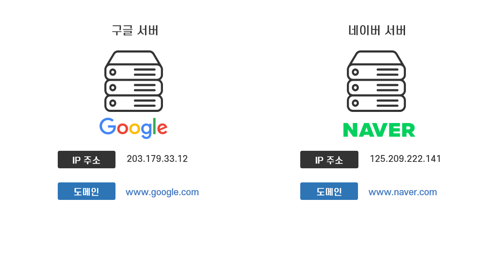
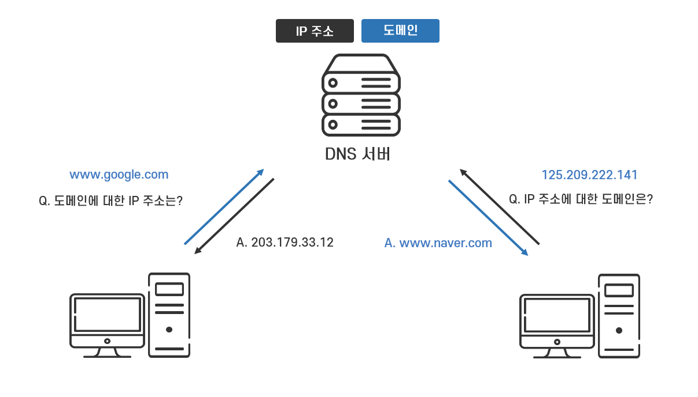
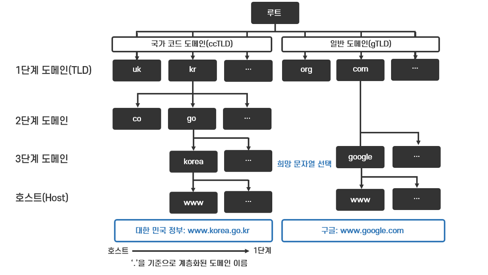
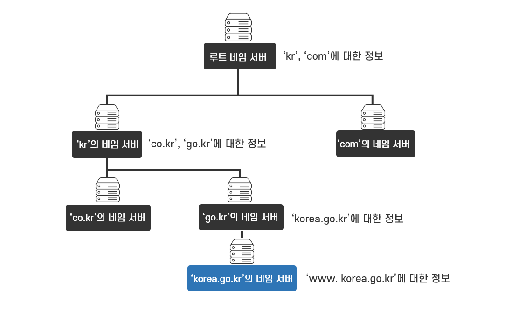

# Domain(도메인)

Domain(도메인)이란 **숫자 형태의 IP 주소를 사람이 기억하기 쉬운 문자로 표현한 주소** 이다.

구글, 네이버 등의 웹사이트를 방문을 원한다면 브라우저에 IP 주소를 입력하면 되거나, 다른 포털 사이트의 검색 결과로 나온 링크를 타고 접속하면 된다. 구글과 네이버가 인터넷에 공개한 IP는 다음과 같다.

- 구글: 203.179.33.12
- 네이버: 125.209.222.141

평생 구글, 네이버 웹사이트만 접속한다면 위 ip 주소를 외우면 된다. 하지만, 접속하고자 하는 웹사이트는 너무나 많다. 그렇기에 **www.google.com, www.naver.com, www.daum.net 등 IP 주소 대신 사람이 기억하기 쉽게 표현한 형태의 영문 주소를 도메인(Domain) 또는 Domain name(도메인 이름 or Host name)** 이라고 한다.

출처: [https://better-together.tistory.com/128](https://better-together.tistory.com/128)

---

# DNS(Domain Name System)

DNS 란 Domain(도메인)과 IP 주소를 저장해 놓은 시스템이다. 즉, **전 세계의 IP 주소에 대응하는 도메인을 효율적으로 관리하기 위해 개발된 시스템** 이다. IP 주소와 도메인을 저장하고 관리하는 컴퓨터나 애플리케이션을 **“DNS 서버”** 라 한다. **DNS 서버는 IP 주소와 도메인을 저장하고 맵핑(mapping)하는 일종의 데이터베이스** 이다.

DNS 서버들이 전 세계의 모든 호스트들의 IP 주소와 도메인을 관리하며 IP 주소를 도메인으로 변환하거나 도메인을 IP 주소로 변환하는 DNS 서비스를 제공한다.

⇒ 도메인에 대응하는 IP 주소를 알고 싶거나 IP 주소에 대응하는 도메인을 알고 싶으면 DNS 서버에 요청하면 된다.

출처: [https://better-together.tistory.com/128](https://better-together.tistory.com/128)

DNS 서버에 IP 주소를 질의하기 위해서는 DNS 서버의 IP 주소를 호스트 컴퓨터가 알고 있어야 한다. 
보통 ISP에서 기본적으로 제공하는 DNS 서버의 IP 주소가 호스트 컴퓨터에 설정되어 있다.
또한, DNS 서버의 IP 주소는 컴퓨터의 TCP/IP 설정 항목 중 하나라 OS 가 이미 알고 있다.

## 도메인의 계층 구조

**Domain(도메인)의 체게적인 분류와 관리를 위해 도메인 이름은 영문자를 ‘. (점)’으로 연결한 계층 구조를 가지고 있다.** 도메인의 계층 구조는 나무를 거꾸로 한 것과 같은 **‘역 트리(Inverted tree) 구조’ 를 가지고 있다.** 트리 구조의 정점을 ‘루트(root)’ 라 한다.

출처: [https://better-together.tistory.com/128](https://better-together.tistory.com/128)

- **1단계 도메인(Top Level Domain)**: 국가 코드 도메인(ccTLD, country code Top Level Domain)과 일반 도메인(gTLD, generic Top Level Domain)이 있다. **‘kr’** 과 같이 국가를 나타내는 정보는 **국가 코드 도메인**, **‘com’** 같이 등록인의 목적에 따라 사용되는 정보는 **일반 도메인** 이다.
- **2단계 도메인(Second Level Domain)**: 1단계 도메인의 하위 도메인으로 조직의 속성을 구분하는 ‘co’(영리 기업), ‘go’(정부 기관), ‘ac’ (대학) 등의 도메인이 있다.
- **3단계 도메인(Domain Name)**: **조직이나 서비스의 이름**을 나타내는 도메인 이름으로 **도메인 사용자가 원하는 문자열을 사용 가능**하다.
- 호스트(Host): 컴퓨터의 이름을 나타낸다.

도메인을 표기할 때는 낮은 단계부터 시작하여 최상위 도메인이 마지막에 나타난다. ⇒ 역 트리(Inversed Tree)

### www.naver.com

- 1단계 도메인(Top Level Domain): 'com'
- 3단계 도메인(Domain Name): 'naver'
- 호스트: 'www'

도메인은 도메인 계층 구조를 반영한 DNS 서버(Name Server)에 저장 및 관리된다. DNS 서버는 도메인 계층의 일부 계층을 담당하고 관리한다. 상위 계층의 DNS 서버는 하위 계층의 도메인에 대한 정보를 관리하고 하위 계층의 DNS 서버의 IP 주소를 가지고 있다.

- 루트 네임 서버에서는 하위 계층인 ‘kr’ or ‘com’ 도메인의 정보를 관리하고 해당 DNS 서버의 IP 주소가 등록되어 있다.
- Top Level 네임 서버에서는 하위 계층인 ‘co.kr’ or ‘go.kr’ 등의 도메인 정보를 관리하고 해당 네임 서버의 IP 주소가 등록되어 있다.
- Second Level 네임 서버의 하위 계층인 Domain Name ‘korea.go.kr’ 등의 도메인 정보를 관리하고 해당 네임 서버의 IP 주소가 등록되어 있다.

출처: [https://better-together.tistory.com/128](https://better-together.tistory.com/128)

이처럼 **DNS는 전 세계의 수많은 도메인을 효율적으로 저장하고 관리하기 위해 도메인을 계층화하고, 계층의 일부 영역을 네임 서버가 분산 관리하는 시스템으로 설계, 운영**되고 있다.

## DNS 서버 질의 과정

모든 DNS 서버는 IP 주소를 알고 있는 루트 네임 서버에 접속하여 IP 주소를 찾기 시작한다. www.naver.com 을 입력하면 다음 과정을 수행하면 IP 주소를 찾는다.

1. 사용자가 www.naver.com 을 입력하면 컴퓨터(OS)는 www.naver.com의 IP 주소를 DNS 서버에 문의
2. DNS 서버는 IP 주소가 등록된 루트 네임 서버에서 IP 주소를 조회
3. 'com' 도메인(Top Level Domain) 정보를 알고 있는 루트 네임 서버는 www.naver.com의 IP 주소를 ‘com’ 네임 서버에 문의하라고 DNS 서버에게 'com' 네임 서버의 IP 주소를 알려준다.
4. DNS 서버는 루트 네임 서버가 알려준 'com' 네임 서버(Top Level)에게 www.naver.com의 IP 주소를 요청하면 'naver.com'(Domain Name)의 네임 서버의 IP 주소를 받는다.
5. 최종적으로 DNS 서버는 'naver.com'네임 서버에게 www.naver.com의 IP 주소를 요청하여 IP 주소를 얻는다.
6. www.naver.com 도메인의 IP 주소를 얻은 DNS 서버는 사용자 컴퓨터에게 IP 주소를 알려준다.

위의 과정은 루트 네임 서버에서부터 하위 계층의 도메인 네임 서버에 www.naver.com의 IP 주소가 모두 없을 경우의 과정이다. 이처럼 반복적으로 IP 주소를 찾아가는건 효율적이지 않다. 그래서 DNS 서버는 요청한 정보를 한동안 **캐시(cache)** 에 저장하여 같은 요청이 들어오면 루트 네임 서버까지 가지 않고 바로 IP 주소를 사용자에게 알려준다.

## Reference

- https://better-together.tistory.com/128