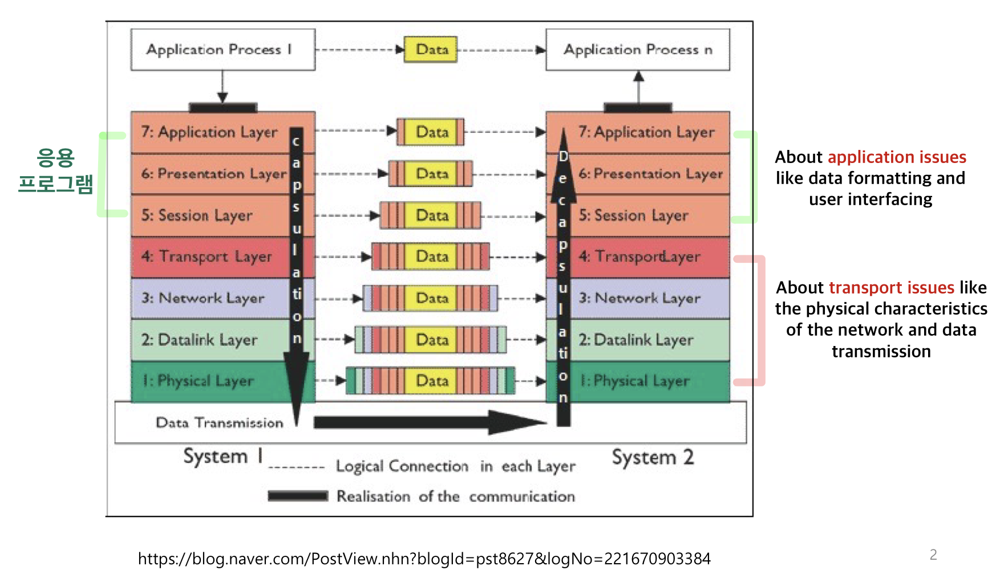

# OSI Model 이란?

Open Systems Interconnection 또는 OSI Model 이란 **7개의 개층에서 네트워킹 또는 통신 시스템의 기능을 설명하는 개념적 모델** 이다. OSI 7계층(OSI Model)은 네트워크와 물리적 장치(케이블) 간에 정보가 송수신되는 방법과 어플리케이션 간에 통신 절차를 설명해주는 개념적 모델이다.

# 왜 OSI Model 을 7계층으로 나눴을까?

OSI Model 은 통신 과정을 독립적이고 7개의 작은 단계로 나눠준다. 이는 **통신 과정을 단계별로 알 수 있으며, 다양한 장비들이 독립적으로 상호 운용**이될 수 있을 뿐더러 **네트워크 관리자는 특정 계층에만 집중**할 수 있다.

> **물리적 장치, 네트워크 등에서 통신이 일어나는 과정을 단계별로 알 수 있고**, **문제 발생 시 빠르고 정확하게 원인 분석이 가능해지며 그 단계만 수정**할 수 있게끔 해준다.
> 

---

# OSI 7 Layers

## Layer 1: Physical Layer (물리 계층)

OSI 참조 모델에서 가장 낮은 계층으로, **물리적 계층의 장치를 통해 구조화 되지 않은 데이터 비트를 전송**하는 역할을 한다. **전기적, 기계적 특성을 이용해서 통신 케이블(물리적 장치)로 데이터를 전송**을 한다. 통신 단위는 비트(0, 1) 이다.

해당 계층의 장치로는 통신 케이블, 모뎀, 네트워크 어댑터, 리피터(신호 증폭기), 허브 등이 있다.

- **Hub(허브)**: 다양한 기기들로부터 오는 전기적 신호를 받아서 그 신호들을 증폭시켜 다른 기기들로 뿌려주는 역할

## Layer 2: Data Link Layer (데이터 링크 계층)

Data Link 계층은 물리 계층에서 발생했을 지도 모르는 **정보의 오류를 검출 및 수정을 담당하여 물리 계층의 장치들 사이에서 안전하게 데이터가 이동될 수 있도록 보장** 해준다. **연결된 장치들 사이의 신뢰성 있는 Data Frame 전송을 책임** 진다.

Data Link 계층은 데이터들이 frame 으로 압축되어 전송되며 MAC 주소를 이용하여 통신한다. 해당 계층은 2개의 서브 계층을 가진다.

- **Media Access Control (MAC)**: MAC 주소 계층은 네트워크 상에서의 송수신 되는 정보의 흐름 관리한다.
    - MAC 주소: 시스템 고유 주소 → 절대 중복 x, 구별 o
- **Logical Link Control (LLC)**: LLC 계층은 물리 계층의 매개체에 대한 에러와 흐름을 관리한다.

해당 계층의 장치로는 브리지, 스위치 등이 있다.

- **스위치**: 여러 컴퓨터가 서로 통신하는 네트워크를 연결해주고, 이 때 발생하는 네트워크 트래픽을 전송하는 기능을 가진 장비.

## Layer 3: Network Layer (네트워크 계층)

Network 계층은 **data link 계층으로부터 data frame 을 받아 frame 내의 주소에 기반하여 이를 목적지까지 전달하는 역할(라우팅)** 을 한다. Network 계층은 **IP 주소(논리적 주소)를 사용하여 패킷을 목적지까지 전달** 한다. 

라우터는 network 계층에서 중요한 역할을 한다. 라우터는 보내려하는 정보가 어떠한 경로로 다른 네트워크로 전달되는 지에 대한 정보를 계속 가지고 있다. 즉, **경로 설정을 수시로 하고 있다.** 만약 최단 경로가 끊어지면 우회 경로를 만든다.

Network 계층은 frame 이 packet(패킷)으로 압축되어 전송된다. 

- **Routing(라우팅)**: 전달되는 패킷의 경로 설정
- **Logical Addressing(논리적 주소)**: 송수신하는 장치들을 인식할 수 있는 주소 체계로, network 계층은 IP 주소를 사용하며 패킷 해더에 sender, receiver 의 IP 주소 정보가 들어가 있다.

## Layer 4: Transport Layer (전송 계층)

Transport 계층은 **패킷 전달, 에러 검사, 흐름 제어, 패킷 순서 지정 등의 역할** 을 갖는다. 또한, **시스템과 호스트 사이의 데이터 이동, 크기, 순서를 조정** 한다. 즉, **최종 시스템 및 호스트 간의 데이터 전송 조율** 을 담당한다.

전송 계층에는 두 개의 프로토콜이 존재한다.

- **TCP(Transmission Control Protocol): 신뢰성, 연결지향적**
- **UDP(User Datagram Protocol): 비신뢰성, 비연결성, 실시간**

## Layer 5: Session Layer (세션 계층)

Session 계층은 **session 이라 불리는 통신 채널을 생성하고 관리하는 역할** 을 담당한다. 통신 채널, session은 포트 연결과 같은 뜻이다. 즉, **세션 계층은 사용자간의 포트 연결(session)이 유효한지 확인하고 관리** 한다.

- IP 주소 + Port 번호 ⇒ 응용 프로그램 구분

## Layer 6: Presetation Layer (표현 계층)

Presetation Layer (표현 계층)은 **데이터가 이후 계층에서 사용할 수 있도록 보장** 해준다. 어**플리케이션의 문법과 의미에 기반하여 데이터를 바꿔준다.** 즉, **네트워크 형식의 데이터를 어플리케이션(응용 프로그램) 형식으로 또는 그 반대로 바꿔주는 역할** 이다. 또한, 데이터를 부호화, 변화, 압축 및 암호화 등을 담당한다.

## Layer 7: Application Layer (응용 계층)

Application Layer (응용 계층)은 **사용자와 직접적으로 소프트웨어 어플리케이션이 상호 작용이 일어나는 계층** 이다. 사용자가 그림 또는 파일을 전송할 때, 응용 계층은 네트워크와 통신하는 다른 응용 프로세스간의 정보 교환을 한다.

Application Layer (응용 계층)은 Network Virtual Terminal, FTAM-File transfer access, and mail/directory 서비스 등의 기능들을 갖는다. 이러한 기능들은 사용자가 보내는 정보에 기반된다.

- POP3 or SMTP for emails (25번 포트)
- FTP for transfering files (22포트)
- Telnet for contralling remote devices → 해당 포트가 접속 가능한지 확인

응용 계층의 예로 웹 브라우저가 있다. (Chrome, FireFox, Safari)