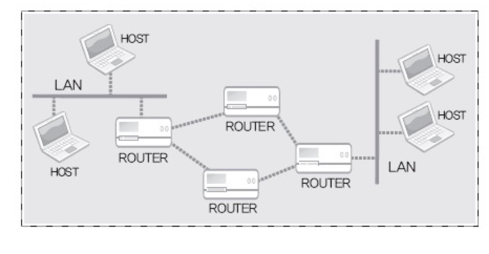

# TCP/IP Protocol Stack (프로토콜 스택)

**인터넷 기반의 데이터 송수신을 목적으로 설계된 스택** 으로 처음에는 문서화를 목적으로 만들어졌다. 

**데이터 송수신이라는 큰 문제를 작게 나눠서 4 개의 영역으로 계층화한 결과** 이다. 또한, 4개의 각 스택 별 영역을 전문화하고 표준화를 했다. 7계층(OSI)으로 세분화가 가능하며, 4계층으로도 표현한다.

## LINK 계층

물리적인 영역의 표준화 결과로서 LAN, WAN, MAN과 같은 물리적인 네트워크 표준 관련 프로토콜이 정의된 영역이다. 아래 그림과 같은 물리적인 연결의 표준이 된다.

## IP 계층

IP 는 Internet Protocol 의 약자로 해당 계층은 **경로 설정과 관련이 있는 프로토콜** 이다. 

- 목적지로 데이터를 전송하기 위해 어떤 경로를 거쳐갈 것인가? → Router(라우터) 이 역할을 담당
- Router 는 최단 경로를 구성하기 위해 주위의 Router 와 끊임없이 신호를 주고 받는다. 이 과정을 통해 주변에 무엇이 있는 지 계속 파악하며, 신호가 없다면 그 경로는 없는 것으로 간주한다.

이 계층에서 발생하는 오류는 해결 방법이 없다.

## TCP/UDP 계층

TCP/UDP 계층은 **실제 데이터의 송수신과 관련 있는 계층으로 전송(Transport) 계층** 이라고도 한다. 

- **TCP**: **데이터의 전송을 보장하는 프로토콜** 로 **신뢰성 있는 프로토콜** 이다.
- **UDP**: **신뢰성을 보장하지 않는 프로토콜** 이다.

⇒ “trade-off” 로 인해 TCP는 신뢰성을 보장하기 때문에 UDP 에 비해 복잡한 프로토콜이다.

TCP 는 아래 그림 처럼 확인(ACK) 과정을 거친다. 확인 과정을 통해 신뢰성을 보장하며, 신뢰성은 재전송 기능으로 보장된다. TCP는 신뢰성을 보장하지만 그만큼 복잡한 과정을 거쳐서 데이터 전송이 이루어진다.

## Application 계층

Application 계층은 프로그래머에 의해 완성되며 응용프로그램의 프로토콜을 구성하는 계층이다. Socket(소켓)을 기반으로 완성하는 프로토콜을 의미한다. Socket(소켓) 생성 시, 위의 LINK, IP, TCP/UDP 계층에 대한 내용이 감춰진다. 이는 Socket API 를 호출하기에 OS 가 알아서 위의 계층에 대한 처리를 해준다. Socket API 를 통해 응용 프로그래머는 Application 계층에만 집중할 수 있게끔 해준다.

- **Socket(소켓)**: **네트워크(인터넷)의 연결 도구로 OS에 의해 제공되는 소프트웨어적 장치** 이다. Socket 은 API 만 사용하면 되기에 프로그래머에게 데이터 송수신에 대한 물리적, 소프트웨어적인 세부내용을 신경 안쓰게끔 해준다.