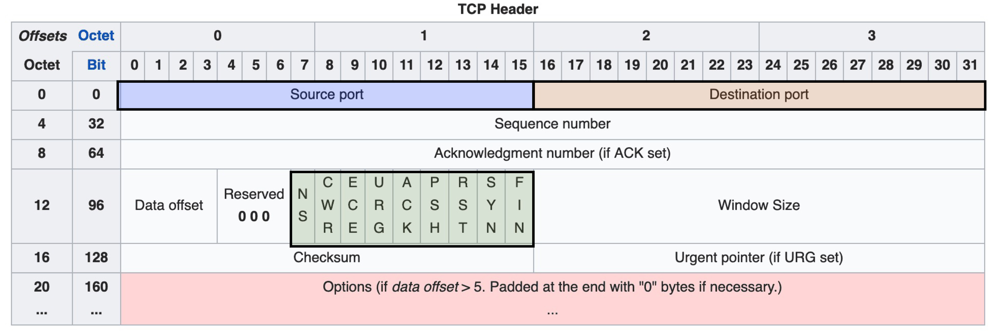
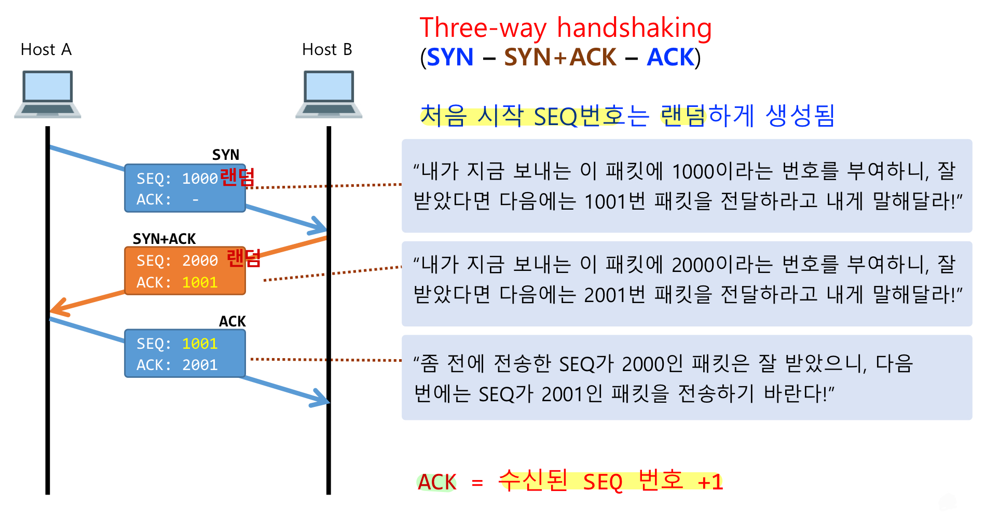
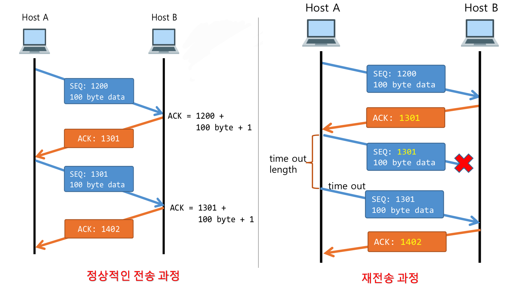
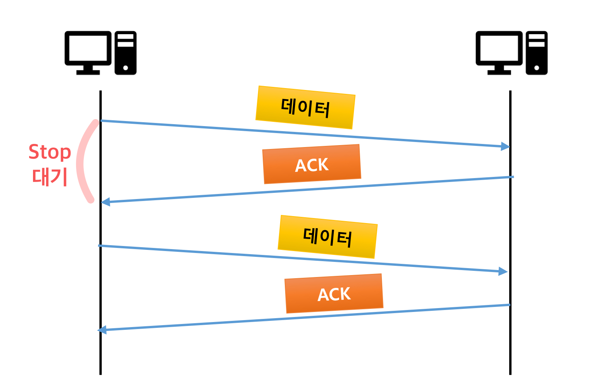
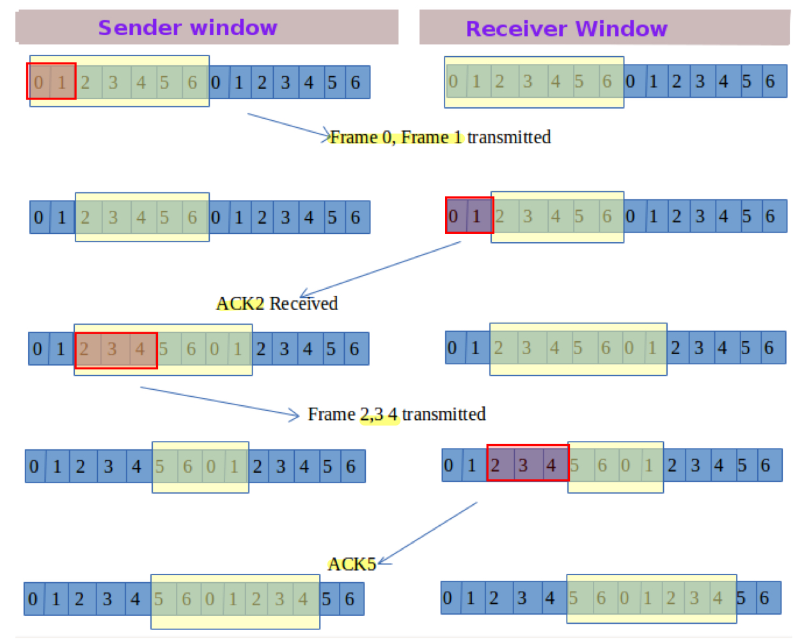
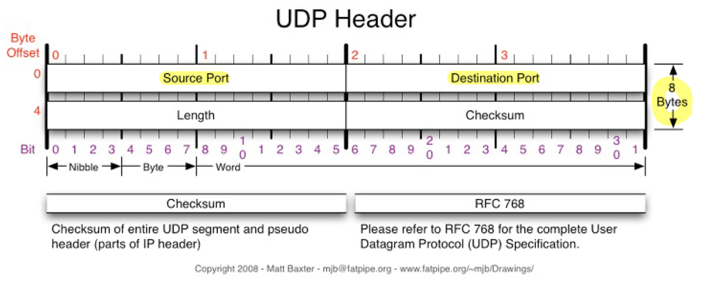

Layer 3: 네트워크 계층(OSI) or 인터넷 계층(TCP/IP)의 **IP 프로토콜**은 수많은 네트워크가 복잡하게 얽힌 인터넷에서 수신지 컴퓨터까지의 경로를 찾아 패킷을 전송하는 역할을 담당한다.

네트워크/인터넷 계층의 **“패킷 전송”** 은 중요한 역할을 담당하지만 수신 지까지 최적의 경로를 찾아 패킷을 전송할 뿐 수진지 컴퓨터가 존재하는지, 패킷을 수신할 준비가 되어 있는지, 전송 과정에서 패킷이 손상되거나 유실되지는 않았는지 등의 문제를 신경 쓰지 않는다. 

즉, **“패킷 전달” 만을 신경 쓸 뿐 패킷의 전송 순서나, 안전성을 보장하지 않는다.**

**패킷의 전송 과정에서 아무런 문제 없이 수신지의 컴퓨터에 도착할 수 있도록 패킷 전송을 제어하는 역할** 은 **전송 계층** 이 담당한다.

### Layer 4: Transport Layer (전송 계층)

Transport 계층은 **패킷 전달, 에러 검사, 흐름 제어, 패킷 순서 지정 등의 역할** 을 갖는다. 또한, **시스템과 호스트 사이의 데이터 이동, 크기, 순서를 조정** 한다. 즉, **최종 시스템 및 호스트 간의 데이터 전송 조율** 을 담당한다.

전송 계층에는 **데이터를 보내기 위해 사용하는 두 개의 프로토콜** 이 존재한다.

- **TCP(Transmission Control Protocol): 신뢰성, 연결지향적**
- **UDP(User Datagram Protocol): 비신뢰성, 비연결성, 실시간**

# TCP (Transmission Control Protocol)

전송 계층의 대표적인 프로토콜인 TCP는 **데이터 전달에 신뢰성을 보장을 위해 “연결형 통신”을 사용하는 프로토콜** 이다. 

TCP 프로토콜은 **데이터를 패킷이라는 여러 개의 작은 조각으로 분할** 하고, **패킷의 흐름 제어** 를 하며, **패킷이 수신지까지 제대로 전송되었는 지를 확인** 한다. 
TCP는 **모든 패킷이 수신지에 제대로 도착했는지 확인**하고 **수신한 데이터의 순서를 송신한 순서대로 재설정하여 패킷들을 재조립함으로써 전체 데이터가 올바르게 전송되도록 하여 신뢰성을 보장**한다.

## TCP 프로토콜의 데이터 전송 단위 및 TCP 헤더

응용 계층의 데이터 단위인 Message(메시지) or Data(데이터)를 전송 계층의 TCP 프로토콜이 받아 작은 조각으로 분할한 데이터 단위를 **“Segment(세그먼트)”** 라고 한다. TCP 프로토콜에 의해 분할된 데이터에 **TCP 헤더** 가 붙어 캡슐화된 단위가 Segment(세그먼트)이다.



- **Source port, Destination port**: 세그먼트에는 송신지와 수신지의 포트 번호가 할당되어 있다. IP 주소의 정보는 할당되어 있지 않다.
    - **포트 번호(Port Number)**: 동일한 컴퓨터 안에서 통신을 하고 있는 애플리케이션을 식별할 때 사용하는 애플리케이션 주소라고 할 수 있다.
- **Sequence Number(순서 번호)**: 전송하는 데이터의 순서를 표시하며, 수신측은 데이터 순서를 파악하고 원래의 데이터로 재조립한다. 즉, TCP 프로토콜은 분할된 데이터에 순서 번호(Sequence Number)를 부여하여 전송 과정에서 전송 순서가 뒤바뀌더라도 수신지에서 전송했던 원래의 데이터로 재조립할 수 있다.
- **Acknowledgement Number(ACK 번호)**: 데이터를 받은 수신자가 다음 시퀀스 번호를 할당해서 전송한다. ACK 번호는 전송측이 수신측에서 데이터를 잘 받았구나를 확인하는 정보로 쓰인다.
- **Checksum**: 데이터의 무결성 확인을 위한 정보로 데이터가 정상인지 비정상인지를 파악한다.
- **Window Size**: 흐름 제어를 위해 송신자에게 자신의 버퍼 크기를 알려서 받을 수 있는 데이터의 크기를 지속적으로 알려주는 역할을 한다.
- Flags
    - **SYN**: 연결 시작을 위해 사용
    - **FIN**: 상대방과의 연결 종료를 위해 사용
    - **ACK**: SYN 응답을 받고 연결을 허락을 위해 사용
    - **URG**: 긴급함을 의미한다. 현재 세그먼트에 포함된 데이터는 아주 긴급한 데이터이므로 우선처리가 될 수 있도록 우선 순위를 높여준다.

## TCP 통신 과정

연결형 통신을 사용하는 TCP 프로토콜은 데이터 전송에 앞서 상대방이 데이터를 수신할 수 있는지의 여부를 확인하기 위해 상대방과의 연결을 확립한 후 통신을 시작한다. 이렇게 TCP는 데이터 전송 전에 정상적인 통신을 위해 연결 설정 단계를 거친 후에 통신 중에도 지속적인 확인 과정을 거쳐 데이터 전송의 신뢰성을 보장한다.

TCP 통신은 **1. 정상적인 통신이 가능한 상태인지를 확인하는 연결 설정 단계**, **2. 데이터 송수신**, **3. 상대방과 연결을 해제**하는 과정을 순차적으로 수행한다.

### 1. 연결 설정 단계

1. 통신을 하기 위해 수신측의 허락을 받아야 하기에 먼저 송신측은 수신측에 연결 확립 허가를 받기 위한 요청을 보낸다. 연결 요청은 별도의 데이터 없이 TCP 헤더만으로 된 정보를 보내는 방법으로 이루어진다. 해당 TCP 헤더에는 연결 요청 Flag인 SYN 을 사용한다.
2. 수신측은 송신측이 보낸 연결 확립 요청에 대한 응답을 하기 위해 응답 허락 Flag 인 ACK를 TCP 헤더에 담은 패킷을 송신측에 보낸다. 동시에 수신측도 송신측으로부터 데이터 전송 허가를 받기 위해 연결 요청 Flag인 SYN 또한 담아 보낸다.
3. 수신측의 요청을 받은 송신측은 수신측에 다시 데이터 전송을 허가한다는 flag 인 ACK를 담아 보낸다.

위의 과정처럼 데이터를 보내기 전에 패킷을 3번 교환하면서 송신측과 수신측의 연결 설정을 하는 과정이 악수를 하는 과정과 비슷하다고 하여 “**Three-way handshaking”** 이라고 한다.



### 2. 데이터 송수신 단계

TCP 프로토콜에서 데이터는 다음 송수신 과정을 수행한다.

```
1. 송신측은 수신측에게 패킷을 전송한다.
2. 수신측은 송신측이 보낸 패킷이 잘 도착했다는 ACK의 값을 보낸다.
	=> 2번 과정에서 송신측은 수신측이 ACK 값을 보내기 전까지 Wait 상태를 가진다.
3. ACK 값을 받은 송신측은 다시 다음 데이터를 가진 패킷을 전송한다.

데이터 전송이 모두 완료할 때까지 위의 과정을 수행한다.
```



- ACK 번호 = 수신된 SEQ 번호 + 전송된 바이트 수 + 1
- ACK의 값을 전송된 바이트 크기만큼 증가시키는 이유: 패킷의 전송유무 뿐만 아니라, 데이터의 손실유무까지 확인하기 위함이다.
- 송신측에서 SEQ 전송 시 타이머가 작동하며, 해당 SEQ에 대한 ACK를 전송 받지 못하는 경우 time out 이 발생하여 데이터를 재전송한다. → 신뢰성을 보장

### 3. 연결 종료 단계

데이터 전송이 완료된 후에 서로의 연결 해제를 위한 요청과 응답을 교환해야 한다. 연결 설정을 할 때는 SYN, ACK Flag 를 사용했다면, 연결 해제는 FIN과 ACK Flag를 사용한다.

```
1. 송신측은 수신측에게 연결 종료 요청(FIN)을 한다.
2. 수신측은 송신측의 연결 종료 요청에 대한 응답(ACK)를 보낸다.
3. 동시에 수신측은 송신측에게 연결을 끊을 준비가 되었다는 종료 요청(FIN)을 보낸다.
4. 송신측은 수신측의 연결 종료 요청에 대한 응답(ACK)를 보낸다.
```

위의 과정을 **“Four-way handshaking”** 이라고 부른다. 이러한 복잡한 과정을 거쳐서 연결을 종료하는 이유는 일방적 종료로 인한 데이터의 손실을 막기 위함이다. 즉, 데이터 전송의 신뢰성을 보장하기 위해서 해당 과정을 거친다.

## TCP 흐름 제어(Flow Control)

흐름 제어 기법(Flow Control)은 **송신측과 수신측의 데이터 처리 속도 차이를 해결** 하기 위한 방법이다.

송신 측과 수신 측이 서로 데이터를 주고 받을 때, 데이터를 받는 수신 측의 처리 속도가 송신 측보다 빠른 경우는 문제가 되지 않지만, 수신 측의 처리 속도가 송신 측보다 느릴 경우 문제가 발생한다.

송신 측과 수신 측은 모두 데이터를 저장할 수 있는 버퍼를 가지고 있다. 수신 측이 자신의 버퍼 안에 있는 데이터를 처리하는 속도보다 송신 측이 데이터를 전송하는 속도가 더 빠르다면, 수신 측의 버퍼는 꽉 차버릴 것이다. 수신 측의 버퍼가 꽉 찬 상태에서 도착한 데이터는 더이상 담아둘 공간이 없기 때문에 버려진다. 이 상황에서 송신 측은 timeout 시 데이터를 재전송을 한다. 또한, 송신 측의 Wait 상태는 길어질 것이다. 통신 속도 또한 중요하기 때문에 TCP 는 흐름 제어(flow control)를 통해 전송 효율을 높여준다.

다음 2가지 방법이 존재한다.

- 정지-대기 (Stop-and-Wait) 기법
- 슬라이딩 윈도우 (Sliding Window) 기법

### 정지-대기 (Stop-and-Wait) 기법

Stop-and-Wait 기법은 말 그래도 상대방에서 데이터를 보낸 후 잘 받았는 지에 대한 응답이 올 때까지 기다리는 방식이다. 전송 측이 프레임을 전송한 다음, 각 데이터 프레임에 대한 ACK를 기다리는 기법으로 ACK 가 도착하면 다음 프레임을 전송한다.



## 슬라이딩 윈도우 (Sliding Window)

정지-대기 기법은 데이터 송신 측의 wait 상태가 길어질 수 있기에 비효율적인 부분이 있다. 슬라이딩 윈도우 (Sliding Window) 기법은 수신 측에서 설정한 윈도우 크기만큼 송신 측에서 확인 응답(ACK) 없이 패킷을 전송할 수 있어 **데이터 흐름을 동적으로 조절** 하는 기법이다. → 전송 효율을 높여 통신 속도를 높여준다.

- **Window(윈도우)**: 전송 및 수신 측에서 만들어진 **버퍼의 크기**

ACK 프레임이 도착하면, 전송 측 윈도우는 ACK 프레임 수에 따라 오른쪽 경계가 이동하여 윈도우 크기가 늘어난다.



---

# UDP

전송 계층의 또 다른 프로토콜인 UDP는 **“비연결 통신”** 이기 때문에 TCP 프로토콜과 같은 흐름 제어(Flow Control)이 없어 SEQ, ACK 같은 메시지를 전달하지 않는다. 또한, TCP 프로토콜의 연결 설정과 연결 해제 과정도 존재하지 않는다. TCP 는 1대 1 연결(전화 통화)을 필요로 하지만, UDP는 연결의 개념이 존재하지 않는다 (데이터를 하나의 **편지**라 간주).

⇒ **UDP 프로토콜은 오직 애플리케이션의 데이터를 전송하는 역할만 담당**한다.

UDP 헤더에는 송신지 포트 번호와 수신지 포트 번호 외에 다른 부가 정보가 없다. 부가 정보가 적고, 응답 확인을 하지 않는 비연결 통신이기에 **데이터의 전송이 빠르다는 장점**이 존재한다. 하지만 비연결 통신이기에 **데이터의 분실 및 손실의 위험이 존재**한다.

이러한 특성 때문에 UDP는 **안전성보다 성능이 중요시 될 때**, **송수신하는 데이터의 양은 작으면서 잦은 연결이 필요한 경우**에 TCP 보다 효율적이다.

## UDP 프로토콜의 데이터 전송 단위 및 UDP 헤더

UDP 프로토콜의 데이터 전송 단위는 TCP 와 마찬가지로 **“Segment(세그먼트)”** 이다.



위의 그림처럼 UDP 헤더에는 송신지 포트 번호와 수신지 포트 번호 외에 다른 부가 정보가 없다.

---

# TCP vs UDP

TCP 와 UDP 는 각각의 장단점이 존재하기 때문에 상황에 따라 효율적인 프로토콜을 선택해야 한다. 
**정확한 데이터 전송보다 빠른 전송이 필요하거나, 잦은 연결이 필요한 경우(트위치 같은 스트림)** 에는 **UDP 프로토콜이 효율적**이다. 
**데이터 전송에서 신뢰성이 보장되어야 하거나, TCP 에 데이터 제어에 관한 것을 맡기고 애플리케이션 개발에만 집중하고 싶은 경우** 에는 **TCP 프로토콜이 효율적**이다.

---

### References

- [https://mangkyu.tistory.com/15](https://mangkyu.tistory.com/15)
- [https://better-together.tistory.com/140](https://better-together.tistory.com/140)
- [https://better-together.tistory.com/134](https://better-together.tistory.com/134)
- [https://evan-moon.github.io/2019/11/22/tcp-flow-control-error-control/](https://evan-moon.github.io/2019/11/22/tcp-flow-control-error-control/)