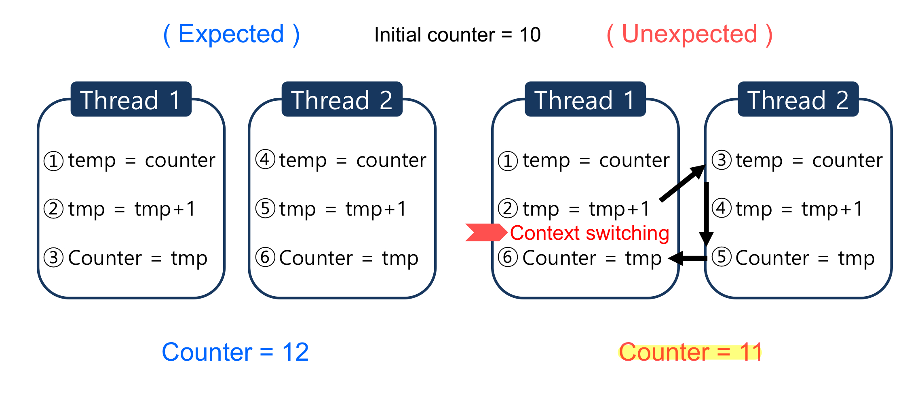
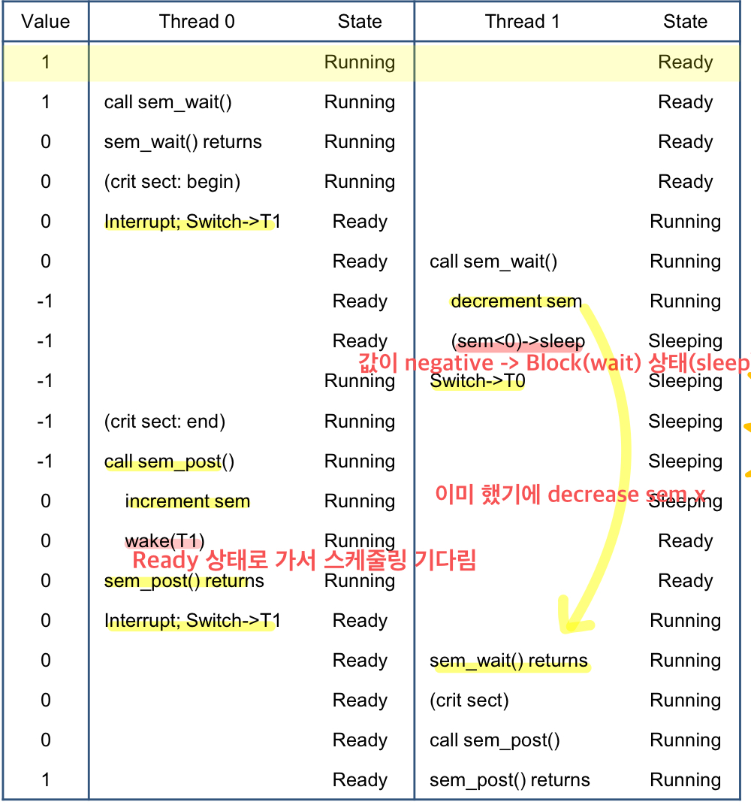

# 동기화 문제(Concurrency Problem)
Multi-Processing, Multi-Threading 프로그램으로 어떠한 작업을 **동시(concurrent, in parallel)** 에 처리할 때 꼭 고려해야할 이슈가 있다. 예를 들어, 만약 멀티 쓰레딩의 경우 2개 이상의 쓰레드는 실행 순서가 정해져있지 않다. 이로 인해 2개 이상의 쓰레드가 공통 자원을 읽고 쓰는 작업 시 해당 자원의 일관성을 해칠 수 있다.



위 그림에서 counter = 10 이란 변수를 공용 자원이라 가정해보자. 2개의 쓰레드는 각각 +1 연산을 하도록 되어 있다. 2개의 스레드가 수행되고 나서 기대되는 counter 의 값은 12 이다. 하지만 두 스레드의 실행 순서가 정해져 있지 않기에 오른쪽 예과 같이 counter = 11 이라는 값을 초래하는 문제가 발생한다.

이렇게 공유된 자원을 동시에 접근 및 수정하여 나타나는 문제를 **Race Condition(경쟁 상태)** 라 한다.

> **경쟁 상태**(race condition)란 둘 이상의 입력 또는 조작의 타이밍이나 순서 등이 결과값에 영향을 줄 수 있는 상태를 말한다. 입력 변화의 타이밍이나 순서가 예상과 다르게 작동하면 정상적인 결과가 나오지 않게 될 위험이 있는데 이를 **경쟁 위험**이라고 한다. - ([*Wikipedia*](https://ko.wikipedia.org/wiki/%EA%B2%BD%EC%9F%81_%EC%83%81%ED%83%9C))

간단히 말하자면, 공유 자원에 대해 여러 프로세스나 쓰레드가 동시에 접근할 때 하나의 자원을 놓고 경쟁하는 상태이다.

하나 이상의 프로세스/스레드가 동시에 접근하여 수정하면 안되는 프로그램 코드 영역을 **Critical Section(임계 구역)** 이라 한다. Critical Section(임계 구역)을 수행하는 다수의 프로세스/스레드는 race condition(경쟁 상태)를 초래할 수 있다. 

이러한 문제점을 해결하기 위해 Critical Section(임계 구역) 은 ***‘atomicity(원자성)’*** 를 보장해줘야한다.

> **atomicity(원자성)**: 명령어 하나가 수행되었으면 중간에 stop 되면 안되며, stop 이 된다면 실행이 안되었다고 처리. 즉, 중간 상태를 허용하지 않는 특성
> 

atomicity(원자성)을 보장하기 위해서 상호 배제(mutual exclusion)가 구현되어야 한다.

## Mutual Exclusion (상호 배제)

Mutual Exclusion(상호 배제)란 둘 이상의 프로세스/스레드가 동시에 Critical Section(임계 구역)에 진입하는 것을 방지하기 위해 사용되는 알고리즘으로, 임계 구역 내에 있는 코드에서 구현된다. 

즉, Critical Section(임계 구역)에 있는 영역은 한 시점에 오직 하나의 프로세스/스레드만이 접근할 수 있다.

이를 구현하기 위한 방법으론 대표적으로 **Mutex(뮤텍스)**, **Semaphore(세마포어)** 가 있다.

## [ Mutex(뮤텍스) ]

두 개 이상의 프로세스/스레드가 Critical Section(임계 구역)에 동시에 접근하지 못하도록 막는 기법이 필요하다. 이를 ‘상호 배제(**Mut**ual **Ex**clusion)’라하며, 이를 줄여 **‘Mutex(뮤텍스)’** 라고 부른다. 뮤텍스는 2개의 연산만이 존재한다.

- **lock**: 현재 임계 구역에 접근할 권한을 얻는다. 만약 다른 프로세스/스레드가 임계 구역을 수행 중이라면 종료할 때까지 대기한다.
- **unlock**: 현재 접근 중인 프로세스/스레드가 임계 구역을 모두 수행(사용)했음을 알린다. 그럼 대기중인 다른 프로세스/스레드가 현재 임계 구역에 접근이 가능해진다.

```c
int pos = 0
int arr[3] = {1, 2, 3};
mutex mutexkey;

// global 변수 arr의 값은 변경하는 함수
void arr_update() {
    lock(mutexkey);  // entry section
    /* critical section begin */
    arr[pos] *= 2;
    pos = (pos + 1) % 3;
    /* critical section end */
    unlock(mutexkey);  // exit section
}
```

프로세스 A, B가 arr_update() 를 서로 수행한다고 가정해보자. 과정은 다음과 같다.

```
1. A) lock mutexkey;
2. A) arr[0] = 2;
==Context Switch==
1. B) lock mutexkey: ==Blocked==
==Context Switch==
1. A) pos = 1;
2. A) unlock mutexkey;
==Context Switch==
1. ==returned from lock==
2. B) arr[1] = 4;
3. B) pos = 2;
4. B) unlock mutexkey;
```

그럼 의도한대로 동시에 2개 이상의 프로세스/스레드가 임계 구역을 수행하지 못할 것이며, 임계 구역은 한 덩어리로 묶여서 실행된다. 이를 **atomic(원자적)** 으로 실행된다고 한다.

## [ Semaphore(세마포어) ]

뮤텍스의 개념과 마찬가지로 복수의 작업을 동시에 병행하여 수행하는 OS에서 공유 자원에 대한 접속을 제어하기 위해 사용하는 신호이다. Semaphore(세마포어)는 현재 자원의 접근에 대한 정보를 나타내는 하나의 **integer variable(S)** 이라고 할 수 있다. 이 S variable 은 프로세스/스레드 동기화에 사용된다. 

세마 포어는 세마포어 값(S)을 변경하는 ***wait()***, ***signal()*** 함수를 사용한다.

- **Wait**: semaphore 의 값을 낮춰준다. 만약 semaphore 값 < 0 이라면 해당 프로세스/스레드는 Block 상태(wait-queue)에 들어간다. 다른 프로세스/스레드가 post를 통해 임계 구역에 접근할 수 있을때까지 기다림.
- **Signal**: semaphore 값 증가 (+1). 만약 하나 이상의 프로세스/스레드가 Block 상태인 경우(차례를 기다리는 상태) 한 프로세스/스레드를 Ready 상태로 바꿔준다. -> ready queue 로 변경 (Wake)

```
wait(S) {
    while (S <= 0)
    S--
}

Signal(S) {
    S++
}
```

Semaphore 값이 1일 때, 스레드 2개가 동작하는 방식은 다음과 같다. 



여기서 sem_post()는 Signal() 함수이다.

# [뮤텍스와 세마포어의 차이]

뮤텍스와 세마포어는 서로 동치 관계에 있다. 즉, 뮤텍스로 세마포어(이진 세마포어)를 구현할 수 있고 세마포어로 뮤텍스를 구현할 수 있다. 세마포어는 동시에 여러 개의 프로세스/스레드가 임계 구역에 접근할 수 있도록 카운트(값)을 가지고 있는데 **카운트(S)가 1인 세마포어가 뮤텍스**이다.

- 뮤텍스는 ***locking mechanism*** 이며, 세마포어는 ***signalling mechanism*** 이다.
    - **Locking Mechanism**: 한 프로세스/스레드가 공유 자원을 사용하려면 해당 자원을 lock한 후 사용한다. 해당 자원을 모두 사용하면 unlock(release) 한다.
    - **Signalling Mechanism**: wait(), signal() 함수를 사용하여 한 프로세스/스레드가 자원을 선점하고 있는 지, 없는 지에 대한 정보를 보여준다. → 세마포어 카운트(값)으로 나타냄.
- 뮤텍스는 **오직 한시점에서의 하나의 프로세스/스레드만이 공유 자원에 대한 접근을 허용**한다. 반면에, 세마포어는 **하나이상의 프로세스/스레드가 허용 가능한 개수(세마포어 값) 선에서 공유 자원에 접근을 허용**한다.
- 뮤텍스에서의 **lock은 한 시점에서 같은 프로세스/스레드에 의해 얻거나 방출**될 수 있다. 반면에, **세마포어의** **값은 자원이 필요한 어느 프로세스/스레드에 의해 변경**되지만 한 시점에 하나의 프로세스/스레드만이 값을 변경할 수 있다.