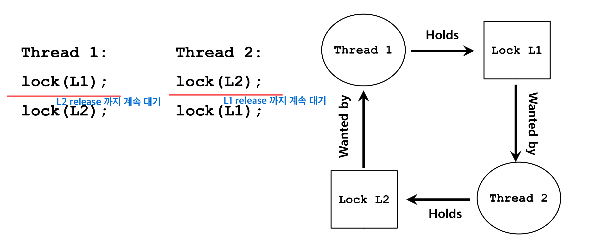

Mutual Exclusion(상호 배제)를 시행하며 발생하는 여러 문제가 있다.

- DeadLock(교착상태)
- Starvation(기아 상태)

## DeadLock(교착 상태)

DeadLock 이란 두 개 이상의 작업이 서로 상대방의 작업이 끝나기 만을 기다리고 있기 때문에 결과적으로 아무것도 완료되지 못하는 상태를 말한다.



위 그림은 Thread 1과 Thread 2 가 서로 교착 상태에 빠진 상황이다.

Thread 1 은 L1 자원을 선점하고 있고 Thread 2 는 L2 자원을 선점하고 있다. 이러한 상황에서 Thread 1과 Thread 2 는 서로 L2, L1 자원을 선점하기 위해 대기 중 상태에 있다. 서로가 아무것도 못하는 이러한 상황을 ***교착 상태*** 라 한다.

DeadLock(교착 상태)은 4가지 조건이 모두 만족해야만 발생한다. 즉, 이 중 하나만 충족 안되도 교착 상태는 발생하지 않는다.

- **Mutual Exclusion(상호 배제):**
- **Hold-and-wait**: 여러 프로세스/스레드는 추가적인 자원을 기다리는 동안 자신들에게 할당된 자원이 있어야 한다. 즉, 필요한 자원의 일부를 가지고 있으며 이외의 필요 자원 갖기 위해 요청하며 기다리는 상태.
- **No preemption**: 자원이 이것을 가진 프로세스/스레드로 부터 강제로 방출(끊어)되지 못하는 상황
- **Circular wait**:  [그림 2]와 같이 서로가 자원을 가진 채로 서로에게 할당된 다른 자원을 필요로하는 상황이여야 한다.

## DeadLock 을 처리하는 방법들

### 1. DeadLock 무시(ignore)

교착상태가 절대 발생하지 않는다는 것이 증명이 되면 무시하는 것이 좋은 방법일 것이다.

### 2. DeadLock 탐지(Detection) and rollback

만약 교착상태가 발견된다면, 다음 방법으로 rollback 또는 재실행하여 교착 상태를 회복할 수 있다.

- Terminating Processes
- Resource Preemption

교착상태를 다루는 여러가지 방법들이 있다. 이 중 적은 비용으로 다루는 방법에 대해 고려해봐야한다. 교착상태에 있는 프로세스/스레드를 단순히 rollback 함으로써 값비싸게 이를 해결할 수 있다.

⇒ rollback 방법은 값비싼 방법이다.

### 3. DeadLock 회피(Avoidance)
이 방법은 deadlock 발생 가능성을 계속 검사하며 발생 가능성이 있다면 회피한다.<br>

**Safe State**, **Unsafe state** 개념 사용

- **Safe State**: DeadLock이 발생하지 않는 상태
- **Unsafe State**: DeadLock 발생 가능성이 있는 상태 => 100% 는 아니다.
 
Safe State에 있는 프로세스/스레드는 언제든지 Unsafe State로 넘어갈 수 있는 가능성이 있다. 회피 방법은 이를 막는 것이다.<br>
즉, **OS는 안전상태를 유지할 수 있는 요구만을 수락하고 불안전 상태를 초래할 사용자의 요구는 나중에 만족될 수 있을 때까지 계속 거절한다.**

DeadLock을 회피하기 위한 방법은 2가지가 있다.
1. 자원이 한 종류일 때: 자원 할당 그래프
2. 자원이 여러 종류일 때: Banker's Algorithm (은행원 알고리즘)


1. **자원 할당 그래프** <br>
A 프로세스가 A'를 보유하며 B 프로세스는 B'를 보유하고 있다고 가정해보자. A는 B'가 필요해 기다리는 상태이다. B 또한 A'를 필요로 해 기다린다면 Cycle이 
발생해 교착상태가 발생할 것이다. B는 A'를 필요로 하는 상태를 막는 것이 자원 할당 그래프이다.
2. **Banker's Algorithm (은행원 알고리즘)** <br>
한 음식점에 스파게티 10인분과 피자 30인분이 있다고 가정해보자. 그럼 이 음식점은 몇 명의 손님을 받아야할까?? 
음식 양만을 따지면 40(10 + 30)명의 손님을 받을 수 있을 것이다. 40명의 손님 중 오직 10명만 스파게티를 원하고 30명은 피자를 원할까? 아니다.
40명 중 20명이 스파게티를 원한다면 20명에게 제공할 스파게티라는 자원이 없다. 이처럼 10명 이상의 손님을 받는다면 이 음식점은 불안정한 상태가 된다. <br>
=> 은행원 알고리즘은 위와 같이 10인분의 스파게티만을 제공할 수 있는 상황에서 10명의 손님만 받아 불안정 상태로 가는 것을 막는 알고리즘이다.

### 4. **DeadLock 예방(prevent)**

### 1. Lock Ordering

Lock Ordering 은 **Circular wait를 예방(Prevention)** 하는 것으로 **Lock 을 획득하는 순서를 정해주는 방법**이다. 

Circular wait 를 피하기 위해 lock을 획득하는 순서를 부여한다. 예를 들면, lock L2 을 얻기 위해선 lock L1을 먼저 얻어야만 한다. 이러한 순서는 아주 세심하게 구현되어야 함으로 이것들을 모두 고려하며 프로그래밍을 하기란 어려운 일 일 것이다. → 하나의 규약처럼 만들어 내부적 시스템적으로 제공할 수 있어야 한다.

### 2. Global Lock

Global Lock 은 **Hold-and-wait**를 **예방(Prevention)** 하는 것으로 lock 을 하나씩 얻는 것이 아니라 **필요한 lock을 한꺼번에 획득(atomically)** 할 수 있도록 한다.

이 방법은 각 프로세스/스레드마다 어떤 lock을 얻어야 하는 지에 대한 정확한 정보를 가지고 있어야 한다. 또한, concurrency 가 감소하는 단점이 있다. concurrency 는 여러 개의 프로세스/스레드가 동시에 동작하는 것을 의미한다. 한 프로세스/스레드가 lock을 동시에 얻었지만 현재 필요헚는 lock까지도 가지고 있어야 하며 다른 프로세스/스레드는 lock을 가진 프로세스가 realease 할 때까지 동작을 못하는 상태가 된다. → 동시에 공유 자원이 사용될 수 있는 기회들이 박탈되며 concurrency 가 감소한다.

### 3. TryLock

TryLock 은 **No preemption** 을 **예방(Prevention)** 하는 것으로 하나의 lock을 가진 상태에서 또다른 lock이 필요하지만 이를 누군가 선점하고 있다면 가지고 있는 lock을 모두 해제하는 방법이다.

```c
top:
  lock(L1);
  // L1 lock을 획득 후에 L2 lock을 획득하려 했을 때
  if( tryLock(L2) == -1 ) {  // L2를 누군가 보유하고 있어 지금 L2에 접근 불가 (-1)
              unlock(L1);  // 필요한 lock이 L1, L2인데 이 중 하나라도 없으면 가진 lock 전부 해제
              goto top;
  }
```

- 만약 2개의 스레드가 계속 반복해서 L1, L2에 대해 deadlock 발생 → 계속 lock을 내려놓고를 반복
    - 이러한 문제로 인해 각 thread가 lock을 얻기 전에 미세한 random delay 를 주면 된다. → **livelock**

### 4. Scheduling Approach

위의 1~3 예방 방법 대신에 신중한 스케줄링으로 deadlock을 피하는 접근 방법이다. 이 방법은 전체 코드, 작업, lock 등을 모두 알아야한다. 또한, 각각의 스레드가 어떤 Processor(CPU)에 어떤 순서로 동작해야 하는지 모두 알고 있어야 한다. → 어렵다,,,

## Starvation(기아 상태)

여러 프로세스/스레드가 **더이상 진행하지 못하고 영구적으로 blocked 되어 있는 상태**이다. 시스템 자원에 대한 경쟁 도중에 발생할 수 있고 프로세스 간의 스케줄링 과정(우선순위)에서도 발생한다. DeadLock 이 발생하면 결국 두 개의 프로세스/스레드는 서로 상대방의 작업이 끝나기만을 기다리고 있기 때문에 결과적으로 아무것도 완료하지 못하는 상태가 된다.